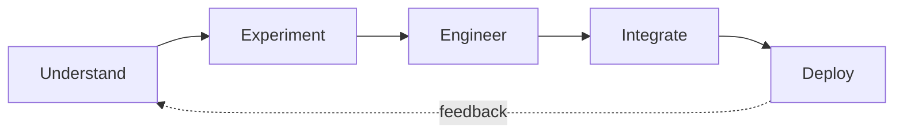

# CORTEX

### Engineering intelligence into real-world systems.

An engineering and research collective building secure, intelligent, and practical technology. 
We take ideas from first experiment to something people can actually use.

 

[**Repositories**](https://github.com/hackathon-cortex?tab=repositories) · [**Featured Projects**](#featured-projects) · [**Collaborate**](#collaborate)

---

## What we do

We work where intelligence, security, and systems engineering meet.

| | |
|---|---|
| **AI & Machine Learning** | Deep learning, computer vision, generative AI, intelligent agents, prediction and decision systems |
| **Autonomous Systems** | Perception, uncertainty estimation, trajectory and adaptive path planning |
| **Security & Cryptography** | End-to-end encryption, secure communication, privacy-preserving design |
| **P2P & Distributed Systems** | Decentralized, real-time networking and synchronization |
| **Full-Stack Engineering** | Web and mobile apps, APIs, scalable backends |
| **Research & Prototyping** | Hackathon builds, experimental systems, proofs of concept |

---

## Featured projects

### Cortex P2P
End-to-end encrypted peer-to-peer communication, designed around secure direct connections with no central point of trust.
`P2P` `E2EE` `Decentralized architecture`
**[cortex-p2p](https://github.com/hackathon-cortex/cortex-p2p)** · **[frontend](https://github.com/hackathon-cortex/cortex_p2p_frintend)**

### Encrypted P2P
A cross-platform exploration of encrypted peer-to-peer messaging.
`Dart` `Networking` `Encryption`
**[encrypted_p2p](https://github.com/hackathon-cortex/encrypted_p2p)**

### Cortex Website
The web presence for Cortex, with a TypeScript frontend and a JavaScript backend.
`TypeScript` `JavaScript`
**[frontend](https://github.com/hackathon-cortex/cortex_website_frontend)** · **[backend](https://github.com/hackathon-cortex/cortex_website_backend)**

---

## How we build

We don't build projects just to make demos. We build to understand the system behind the idea.

- **Understand:** break the problem down before choosing the technology.
- **Experiment:** build small, test assumptions, validate fast.
- **Engineer:** think past the prototype to architecture, security, scale and reliability.
- **Integrate:** connect AI, software, infrastructure and real-world constraints.
- **Deploy:** a project isn't finished when it runs locally. It's finished when someone can use it.

**We hold ourselves to:** clean architecture · reproducibility · security · performance · documentation · real-world usability

---

## Tech we use

Tools follow the problem, never the reverse.

<b>Full stack overview</b>

 

| Area | Tools |
|---|---|
| **Languages** | Python, C++, Java, Kotlin, Dart, JavaScript, TypeScript |
| **AI / ML** | TensorFlow, Keras, scikit-learn, PyTorch, OpenAI, Computer Vision |
| **Backend** | FastAPI, Flask, Node.js, REST, WebSockets |
| **Frontend** | React, TypeScript, HTML, CSS |
| **Mobile** | Flutter, Dart, Kotlin |
| **Infrastructure** | Git, GitHub, Docker, Vercel, Render, Firebase |
| **Security & Networking** | E2E encryption, cryptography, P2P networking, distributed systems |

---

## Open source

Good engineering should be shared, challenged, and improved, so most of our work is public.

**Star** a project you like · **open an issue** when something breaks · **send a pull request** when you can fix it · **start a discussion** when you have a better idea.

---

## Collaborate

We want people who enjoy building difficult things, in AI/ML, security, networking, autonomous systems, full-stack, mobile, or research.

**Have an idea? Let's build it.** Start a discussion on any repository or find us on [GitHub](https://github.com/hackathon-cortex).

 

**CORTEX** · *Build beyond the obvious.*

Research · Engineer · Experiment · Deploy

